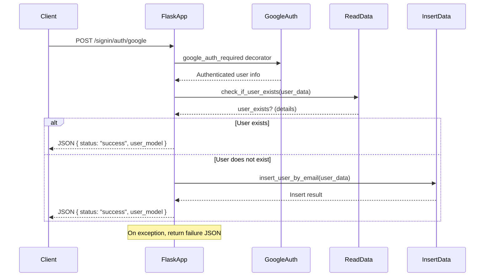

<svg fill="none" viewBox="0 0 600 300" width="600" height="300" xmlns="http://www.w3.org/2000/svg">
  <foreignObject x="0" y="0" width="600" height="300"> 
  

   <h1 align="center">Google OAuth</h1>
   
   
* **New Features**
  * Introduced a new Flask application structure with an app factory and blueprint-based routing.
  * Added Google Sign-In authentication routes with user existence checks and user creation.
  * Implemented CORS support with environment-based origin restrictions.

* **Chores**
  * Added a new entry point script to start the application and load environment variables.
  * Centralized route registration for easier management.

* **Bug Fixes**
  * Updated import statements for improved module referencing.

* **Style**
  * Added debug print statements for backend responses.

---

<!-- end of auto-generated comment: release notes by coderabbit.ai -->

The changes introduce a Flask application structure with a new app factory, blueprint-based routing, and entry-point script. Route handling for Google Sign-In is implemented with authentication, user existence checks, and insertion logic. Debugging output and import adjustments are made, and environment-based configuration is established for deployment flexibility.

## Changes

| File(s)                                           | Change Summary                                                                                  |
|---------------------------------------------------|-------------------------------------------------------------------------------------------------|
| app/Repository/ReadData.py                        | Added a debug print statement in `check_if_user_exists` after fetching backend JSON.            |
| app/SigInSignUp/UserActivity.py                   | Changed import of `googleAuthRequired` to use a relative import within the app package.         |
| app/__init__.py                                   | Added `createApp` Flask application factory function; registers blueprint and returns app.      |
| app/routes/__init__.py                            | New file; imports `blue_print` and defines a `routes` list containing it.                       |
| app/routes/routes.py                              | New module; defines Flask app, CORS, blueprint, root and `/signin/auth/google` routes, with authentication and user handling logic. |
| run.py                                            | New entry-point script; loads environment, creates app, runs it on specified port in debug mode. |

---

## Sequence Diagram

---

   References :
  <ul>
    <li><a href="https://developers.google.com/identity" target="_blank">Google Identity</a></li>
    <li><a href="https://console.cloud.google.com" target="_blank"/>console cloud google</a></li>
  </ul>

</foreignObject>

</svg>

